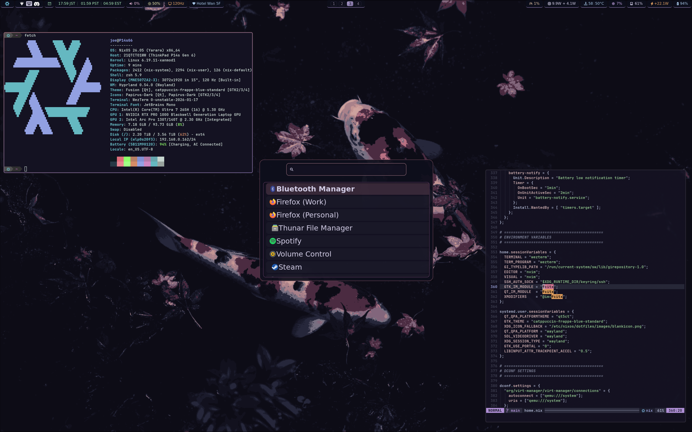

# P14sG6 (Intel/NVIDIA) NixOS Config

Backup and reproducible config for my personal [NixOS](https://nixos.org) system, currently configured for a ThinkPad [P14s Gen 6](https://psref.lenovo.com/syspool/Sys/PDF/ThinkPad/ThinkPad_P14s_Gen_6_Intel/ThinkPad_P14s_Gen_6_Intel_Spec.pdf), and soon to be [51nb X210ai](https://macdat.net/laptops/jxtech/x210ai.php).

Config files for:
- [Hyprland](https://hyprland.org) a spicy wayland compositor.
- [WezTerm](https://wezfurlong.org/wezterm/), a fast feature-rich terminal.
- [Neovim](https://neovim.io), my preferred text editor.
- [Zsh](https://ohmyz.sh/), a great shell with a neat wrapper.
- [Waybar](https://github.com/Alexays/Waybar), a simple status bar.
- [nwg-shell](https://nwg-piotr.github.io/nwg-shell/), some nice Wayland UI stuff.
- [Wofi](https://hg.sr.ht/~scoopta/wofi), a quick application launcher.
- [Yazi](https://yazi-rs.github.io), an efficient TUI file browser.
- [AGS](https://aylur.github.io/ags/) **⚠️ WIP**
- [EWW](https://elkowar.github.io/eww/) **⚠️ WIP**
...and more, along with some useful scripts. 

To-do list: 
- reliable, power-efficient sleep
- power saving tweaks (dGPU D3hot, CPU stuff)
- fcitx login notif thing (complains about env var)
- explore AGS and EWW
- make things look nicer (skill issue)

Why NixOS?
- **Declarative system configuration**: your entire system lives in version-controlled text files you can read, understand, and modify in one place (no more mystery edits buried deep in /etc, forgotten PPAs, config drift, or "I ran some command 3 years ago and now I can't remember what it was")
- **Reproducible**: same config = same system bit-for-bit identical, deploy to new machines in minutes, no messy "hope it works" install scripts
- **Atomic updates and rollbacks**: system changes are transactional (either fully applied or not at all) and trivially reversible, making your system unbreakable
- **Isolated dependencies**: multiple versions of packages coexist without conflicts, never encounter dependency hell
- **Security**: immutable system files, easy auditing of the entire system state
- **Nixpkgs**: largest (ever-growing) collection of pre-built, reproducibly packages software for any distro
- **Nix-shell**: per-project environments on the fly, without all the annoying complex overhead of things like docker
