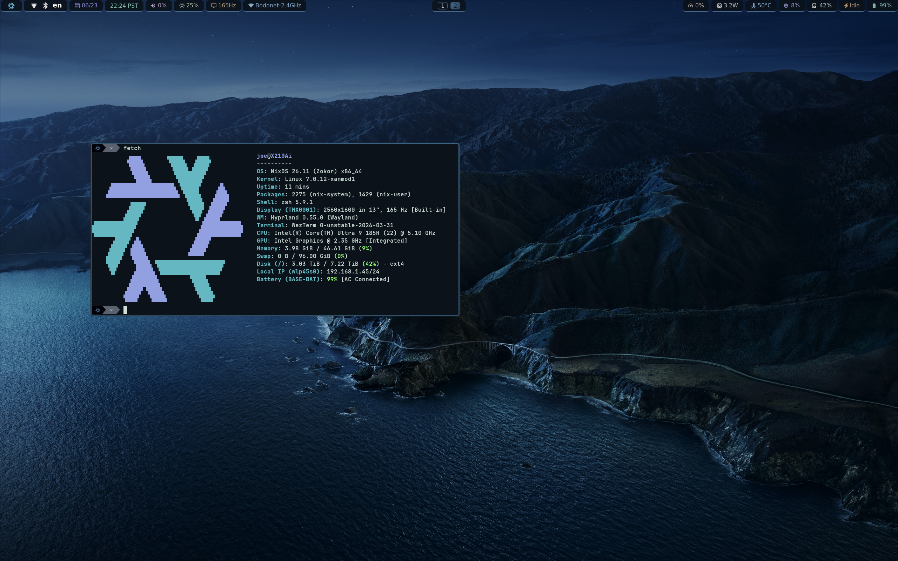
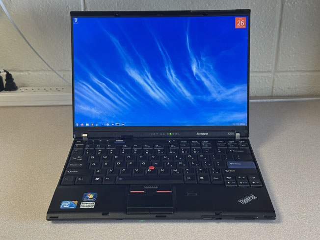

# P14sG6 (Intel/NVIDIA) NixOS Config

Backup and reproducible config for my personal [NixOS](https://nixos.org) system, currently configured for an [X210Ai](https://macdat.net/laptops/jxtech/x210ai.php). I don't really know how to use git.

## Config files for:
- [Hyprland](https://hyprland.org) a spicy wayland compositor.
- [WezTerm](https://wezfurlong.org/wezterm/), a fast cool terminal.
- [Neovim](https://neovim.io), my preferred text editor.
- [Zsh](https://ohmyz.sh/), a great shell with cool wrappers.
- [Waybar](https://github.com/Alexays/Waybar), an extensible status bar.
- [nwg-shell](https://nwg-piotr.github.io/nwg-shell/), some nice Wayland UI stuff.
- [Wofi](https://hg.sr.ht/~scoopta/wofi), an application launcher.
- [Yazi](https://yazi-rs.github.io), an efficient TUI file browser.
- [EWW](https://elkowar.github.io/eww/), handy widget maker.

...and more, along with some useful scripts. 

## To-do list (hardware):
- get NOS keyboard + palmrest
- eGPU connector installation + bezel design/print
- half-size mSATA<>SATA drive installation
- reclaim the other 48GB SODIMM for 96GB RAM
- test/resolve trackpoint<>panel interference
- test JIS keyboard scancodes and Esc/A/Z issue
- photodiode test backlight PWM
- 6-cell battery capacity tuning
- 9-cell battery issues
- resolve boot issues...
- test TB/USB-C port funtionalities
- speaker upgrade
- reinforce lid

## To-do list (software)
- see if PL limits can be set properly in BIOS and userspace
- test cooling system max load + set PL values accordingly
- suspend testing and optimization (Meteor Lake doesn't do s3)
- Win10LTSC installation + config on mSATA<>SATA drive
- resolve hypr compositing CPU util
- eww panel/buttons
- local AI optimization
- help menu for other ppl
- fcitx5 mozc IME issues (??)
- make things look nicer (ongoing skill issue)
- set up game launcher/wrapper, WINE tweaks/testing for old game library, plutonium setup 

## X210Ai EC quirks as of June-ish 2026
- (FW bug) battery TDP setting isn't possible: currently gimped
- (FW bug) manual VRAM allocation for iGPU isn't possible
- (FW bug) <100% boot success rate (takes a minute + reboots)
- (FW bug) no custom fan curves
- (FW bug) resuming from suspend/hibernate is not reliable

## Why NixOS?
- **Declarative system configuration**: your entire system lives in version-controlled text files you can read, understand, and modify in one place (no more mystery edits buried deep in /etc, forgotten PPAs, config drift, or "I ran some command 3 years ago and now I can't remember what it was")
- **Reproducible**: same config = same system bit-for-bit identical, deploy to new machines in minutes, no messy "hope it works" install scripts
- **Atomic updates and rollbacks**: system changes are transactional (either fully applied or not at all) and trivially reversible, making your system unbreakable
- **Isolated dependencies**: multiple versions of packages coexist without conflicts, never encounter dependency hell
- **Security**: immutable system files, easy auditing of the entire system state
- **Nixpkgs**: largest (ever-growing) collection of pre-built, reproducibly packages software for any distro
- **Nix-shell**: per-project environments on the fly, without all the annoying complex overhead of things like docker

## Why X210Ai?
The X200 is really well engineered, and laptop design has regressed in most aspects since the 2000s (aside from getting a bit thinner/lighter):
| **Feature** | **X210Ai** | **Modern Laptop (ex: Framework or ThinkPad)** |
|---|---|---|
| Keyboard | 7-row, deep travel, full size keys | 6-row, shallow travel, chiclet, missing useful keys |
| Chassis | Magnesium, latching lid, excellent serviceability | Cheap aluminum and plastic, no lid latch, usually a pain to service |
| Battery | Removable (latched) 4/6/9-cell up to ~116Whr | Not-removeable (internal), one size, <100Whr |
| Trackpoint | Exists. Has nice click buttons. | Doesn't exist, or has uncomfortable thin buttons |
| Amenities | 10 status LEDs, reading light, underglow, keyboard drain pan | 0 or 1 status LED, backlit keyboard, not safe against spills |
| Screen | Literally any eDP panel that fits | Maybe decent panel(s)? Not always |
| Extensibility | Internal space + PCIe lanes for: eGPU adapter, DAQ/amp, USB hubs, etc; touchpad + FP reader optional | Framework: hot-swap USB-C port thingies. Other laptops: ...nothing |
| Ports | More | Less |
| Storage | PCIe5 NVMe + PCIe4 NVMe + SATA-III SSD (total 20TB max) | 1-2 PCIe4/5 NVMes (8-16TB max) |
| Platform firmware | Fully exposed AMI BIOS: hundreds of parameters | Extremely limited BIOS configurability |

## What makes the X210Ai so special?
Designing and producing a modern laptop motherboard is not trivial. Some of the main hurdles are:

- **Reference design**: Intel provides a Customer Reference Design (CRD, essentially a complete schematic and layout you can adapt) to select partners. I'm not sure how they got this.

- **PCB design**: Even with the CRD, adapting the design to fit the exact footprint of an old X200 motherboard is a lot of work: you're dealing with thousands of pins, complex power sequencing, PCIe/USB4 signal integrity concerns, etc., all while tring to get connectors and mounting holes and such in exactly the right places. Modern laptop SoCs need extremely tight impedance-controlled routing (especially for LPDDR5 and Thunderbolt/USB4), which neccessitates a lot of complex signal integrity simulation work. 

- **Sourcing and production**: Intel doesn't sell laptop CPUs to random buyers; you need to be a registered ODM/OEM with volume commitments. JXtech/HOPE/51nb/etc have some secret ODM partner who can supply them with small volumes (100s) of CPUs. Tight production requirements for what7s probably a 8-12 layer board. Small batch (100-200 boards) SMT assembly isn't hard to find, but the CPU package at least requires X-ray inspection, and ICT fixtures are expensive (maybe that part is skipped?).

- **Chassis modifications**: Fitting a 13.3" panel in place of the original 12" panel isn't rocket science, but takes care to be done cleanly (OEM-like fit and finish) while maintaining lid structural integrity. Other tasks included custom heatsink design, machining the original magnesium chassis, designing port bezels for an OEM look, etc.

- **Firmware/BIOS**: Modern Intel platforms require FSP (Firmware Support Package) blobs from Intel, only available to licensed partners. The X210Ai uses an AMI commercial UEFI base + Intel FSP, adapted for the board. EC (embedded controller) firmware for the keyboard, status LEDs, battery charging, cooling fan, etc. has to be written (or reverse engineered and adapted from original X200).
