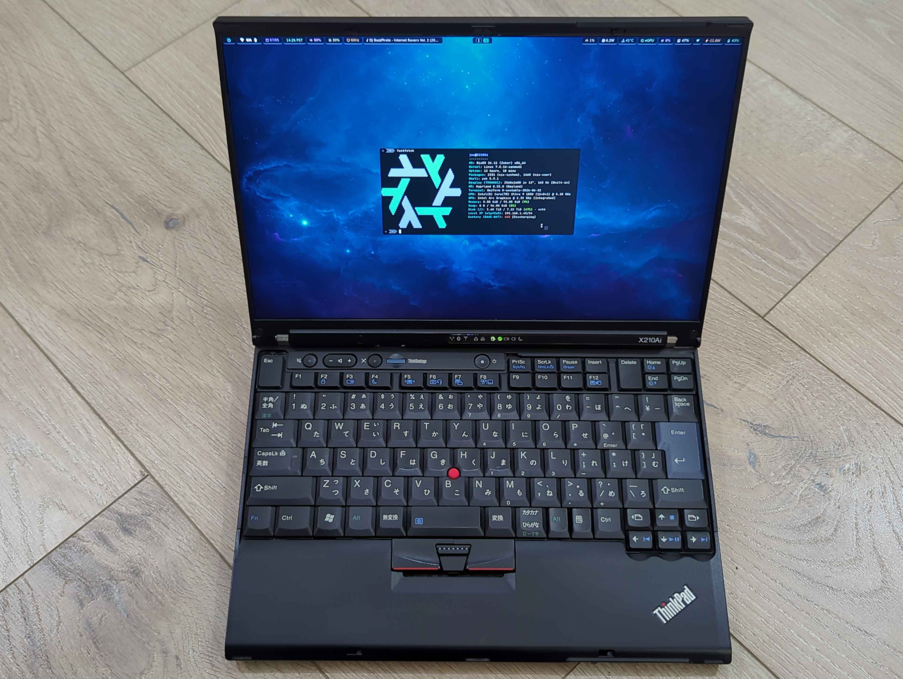

# X210Ai NixOS Config

Backup and reproducible config for my personal [NixOS](https://nixos.org) system, currently configured for an [X210Ai](https://macdat.net/laptops/jxtech/x210ai.php).

---

## Config files for:
Wayland stuff:
- [Hyprland](https://hyprland.org), [waybar](https://github.com/Alexays/Waybar), [nwg-shell](https://nwg-piotr.github.io/nwg-shell/), [wlogout](https://github.com/ArtsyMacaw/wlogout), [dunst](https://github.com/dunst-project/dunst), [wofi](https://hg.sr.ht/~scoopta/wofi), [eww](https://elkowar.github.io/eww/), etc.

Other stuff:
- [WezTerm](https://wezfurlong.org/wezterm/), a fast terminal.
- [Neovim](https://neovim.io), my preferred text editor.
- [Zsh](https://ohmyz.sh/), a feature-rich shell.
- [Yazi](https://yazi-rs.github.io), an efficient TUI file browser.
- [Starship](https://starship.rs/), a fast shell prompt.

...and more, along with some useful scripts. 

## X210Ai To-do List (hardware):
- test X200 JP106 keyboard scancodes and Esc/A/Z issue
- SK-8855 ThinkLight/power button wiring (major PITA)
- photodiode test backlight PWM
- re-celled battery capacity adjustment
- troubleshoot Oculink eGPU (PCIe dropout during VAE decode)
- troubleshoot 35W cooling capacity: should be closer to 60W?
  - test on other X210Ai machines
- speaker upgrade?
- lid reinforcement

## To-do list (software)
- diagnose package power discrepency between Windows and Linux
- fix fcitx5 mozc IME
- make things look nicer (ongoing skill issue)
- test PL adjustment and undervolting

## X210Ai EC/BIOS bugs/quirks as of July-ish 2026
- PL values cannot be manually set in userspace
- no custom fan curves, fan tacho not exposed
- resuming from suspend/hibernate might not be reliable
- sometimes the fan locks at low speed (--> temps>100C)
- disabling OC/CFG locks pins all cores at 400MHz (??)

## Why NixOS?
- **Declarative system configuration**: your entire system lives in version-controlled text files you can read, understand, and modify in one place (no more mystery edits buried deep in /etc, forgotten PPAs, config drift, or "I ran some command 3 years ago and now I can't remember what it was")
- **Reproducible**: same config = same system bit-for-bit identical, deploy to new machines in minutes not hours, no messy "hope it works" install scripts
- **Atomic updates and rollbacks**: system changes are transactional (either fully applied or not at all) and trivially reversible, making your system unbreakable
- **Isolated dependencies**: multiple versions of packages coexist without conflicts, never encounter dependency hell
- **Security**: immutable system files, easy auditing of the entire system state
- **Nixpkgs**: largest (ever-growing) collection of pre-built, reproducibly packages software for any distro
- **Nix-shell**: per-project environments on the fly, without all the annoying complex overhead of things like docker

## Why X210Ai?
The original X200 laptop from 2008 is really well engineered, and laptop design has regressed in most aspects since the 2000s (aside from getting a bit thinner/lighter, and cooling system improvements). The X210Ai has perks that no other modern laptop does:
- awesome keyboard (7-row, deep travel, raised TrackPoint click buttons)
- awesome chassis (cast + machined magnesium exoskeleton, excellent serviceability)
- latching clamshell lid
- hot-swappable battery, 4/6/9-cell options up to ~113Whr (9x 3500mAh 18650)
- amenities: status LEDs (10x), reading light, RF kill switch
- spill-proof keyboard (pan + drain holes)
- hackability:
    - 100s of exposed BIOS settings
    - full control of PL settings, overclocking, undervolting, etc.
    - extra chassis space to fit things (I squeezed in an Oculink port, extra USB port, and audio DAC/amp in the drive bay while still fitting an mSATA SSD on the SATA port)
- 3 drive slots (PCIe 5, PCIe 4, SATA-III) = 20TB max storage currently
- many screen options
    - Best: 13.4" 165Hz 2560x1600, 100% DPI-P3, 500nits, Pantone validated, 6msec black-to-white, DC dimming
    - Others: 13.3" 1920x1200, 13" 3000x2000, 12.6" 2880x1920, 12.5" 1920x1080, 12.1" 1440x900 and 1280x800
    - ...or literally any eDP or LVDS panel, just wire it up yourself
- lots of ports
- 60W cooling capacity in a 13" chassis
- coreboot "soon"(TM) (maybe)

## What makes the X210Ai so unique?
51nb/JXtech's custom Thinkpads (X62/63, X210/2100/210Ai, T50/70/700) are the only projects of their kind, and that's not likely to change: designing and producing a modern laptop motherboard is not trivial and gets more complex each generation. Some of the main hurdles are:

- **Reference design**: Intel provides a Customer Reference Design (CRD, essentially a complete schematic and layout you can adapt) to select partners. Good luck getting that.

- **PCB design**: Even with the CRD, adapting the design to fit the exact footprint of an old X200 motherboard is a lot of work: you're dealing with thousands of pins, complex power sequencing, PCIe/USB4 signal integrity concerns, etc., all while tring to get connectors and mounting holes and such in exactly the right places. Modern laptop SoCs need extremely tight impedance-controlled routing (especially for LPDDR5 and Thunderbolt/USB4), which requires complex signal integrity simulation work. 

- **Sourcing and production**: Intel doesn't sell laptop CPUs to random buyers; you need to be a registered ODM/OEM with volume commitments. JXtech/HOPE/51nb/etc have some secret ODM partner who can supply them with small volumes (100s) of CPUs. Tight production requirements for what7s probably a 8-12 layer board. Small batch (100-200 boards) SMT assembly isn't hard to find, but the CPU package at least requires X-ray inspection, and ICT fixtures are expensive (maybe that part is skipped?).

- **Chassis modifications**: Fitting a 13.4" panel in place of the original 12" panel isn't rocket science, but takes care to be done cleanly (OEM-like fit and finish) while maintaining lid structural integrity. Other tasks included custom heatsink design, machining the original magnesium chassis, designing port bezels for an OEM look, etc.

- **Firmware/BIOS**: Modern Intel platforms require FSP (Firmware Support Package) blobs from Intel, only available to licensed partners. The X210Ai uses an AMI commercial UEFI base + Intel FSP, adapted for the board. EC (embedded controller) firmware for the keyboard, status LEDs, battery charging, cooling fan, etc. has to be written (or reverse engineered and adapted from original X200).
