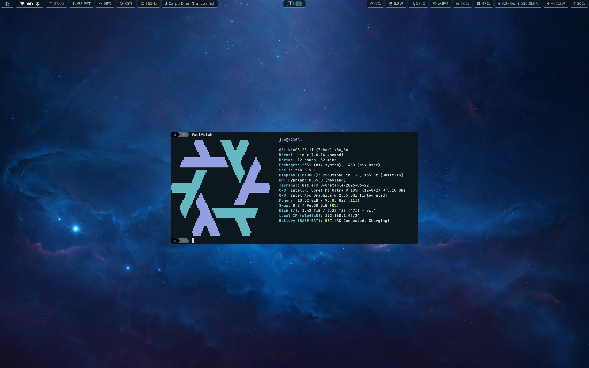

# P14sG6 (Intel/NVIDIA) NixOS Config

Backup and reproducible config for my personal [NixOS](https://nixos.org) system, currently configured for a ThinkPad [P14s Gen 6](https://psref.lenovo.com/syspool/Sys/PDF/ThinkPad/ThinkPad_P14s_Gen_6_Intel/ThinkPad_P14s_Gen_6_Intel_Spec.pdf), and soon to be [51nb X210ai](https://macdat.net/laptops/jxtech/x210ai.php). I don't know how to use git properly.

## Config files for:
- [Hyprland](https://hyprland.org) a spicy wayland compositor.
- [WezTerm](https://wezfurlong.org/wezterm/), a fast cool terminal.
- [Neovim](https://neovim.io), my preferred text editor.
- [Zsh](https://ohmyz.sh/), a great shell with cool wrappers.
- [Waybar](https://github.com/Alexays/Waybar), an extensible status bar.
- [nwg-shell](https://nwg-piotr.github.io/nwg-shell/), some nice Wayland UI stuff.
- [Wofi](https://hg.sr.ht/~scoopta/wofi), an application launcher.
- [Yazi](https://yazi-rs.github.io), an efficient TUI file browser.
- [EWW](https://elkowar.github.io/eww/) **⚠️ WIP**

...and more, along with some useful scripts. 

## To-do list: 
- dynamic vfio binding (free dGPU for AI loads)
- VM/host file sharing (virtiofs)
- fix Looking Glass
- Arrow Lake local AI issues (or dGPU cold-binding)
- hypr compositing CPU util at high refresh rates
- eww panel
- help menu for other ppl
- fcitx5 mozc IME issues (??)
- make things look nicer (ongoing skill issue)
- set up game launcher/wrapper, WINE tweaks/testing for old game library, plutonium setup 

## Why NixOS?
- **Declarative system configuration**: your entire system lives in version-controlled text files you can read, understand, and modify in one place (no more mystery edits buried deep in /etc, forgotten PPAs, config drift, or "I ran some command 3 years ago and now I can't remember what it was")
- **Reproducible**: same config = same system bit-for-bit identical, deploy to new machines in minutes, no messy "hope it works" install scripts
- **Atomic updates and rollbacks**: system changes are transactional (either fully applied or not at all) and trivially reversible, making your system unbreakable
- **Isolated dependencies**: multiple versions of packages coexist without conflicts, never encounter dependency hell
- **Security**: immutable system files, easy auditing of the entire system state
- **Nixpkgs**: largest (ever-growing) collection of pre-built, reproducibly packages software for any distro
- **Nix-shell**: per-project environments on the fly, without all the annoying complex overhead of things like docker

## Why P14sG6? 
- want jp106 keyboard, trackpoint, and physical click buttons -> **ThinkPads are the only option**
- don't want a gimped ultrabook w/ tiny cooling capacity, don't want a heavy briefcase laptop
  - P14s (14.5", 3.5lb, ~60W steady-state) is OK
- bells and whistles:
  - **Blackwell dGPU (8GB)** for local AI loads + Windows VM (CAD)
  - **96GB RAM** / **8TB SSD** = no resource constraints (but only 6400MHz; not LPCAMM)
  - **~60W steady-state** cooling capacity, w/ Arrow Lake ultrabook-like efficiency on battery
  - great **3072x1920 120Hz** panel (IPS, not glossy, DC dimming not PWM, full DCI-P3 coverage)
  - big-ish **75Whr battery** and a real RJ-45 **ethernet port**
  - excellent **platform firmware** (EC, ACPI): full control over PL states, fan curves, battery thresholds + calibration, good thermal sensor suite,  MSR edits (turbo ratios, RAPL), direct access to UEFI vars, fwupd, etc... Framework is the only other laptop OEM competitive on this.

## What about X210ai?
- can't handle jp106 keyboard (proprietary EC)
- (FW bug) battery TDP setting isn't possible: currently gimped
- (FW bug) manual VRAM allocation for iGPU isn't possible
- (FW bug) battery level display is inaccurate
- (FW bug) long-press shutdown breaks battery/AC status LEDs and ThinkLight
- (FW bug) <100% boot success rate (requires long-press restart)
- (FW bug) no custom fan curves
- (FW bug) resuming from suspend-to-RAM is not reliable
- (FW bug) resuming from hibernation is not reliable
- ~useless touchpad
- display is kinda fragile, trackpoint leaves a mark on it
- Thunderbolt/USB-C is really janky
- heavier and thicker than P14s (3.6->4.3lb, 18mm->28mm)
- less overall power (~45W cooling limit?) and less efficiency (Meteor vs. Arrow Lake)
- no DGPU
- horrible speakers
- previous 51nb machines (x210, x2100) had misc. issues
+ supports 128GB RAM, 20TB SSD (8TB NVMe, 8TB SATA, 4TB mSATA)
+ nicer keyboard
+ fun, hackable internals
+ swappable battery (hot swap on AC power)
+ chassis is a work of art, looks beautiful
+ can ditch the touchpad
+ coreboot support "maybe"
+ advanced BIOS features
+ holds value
